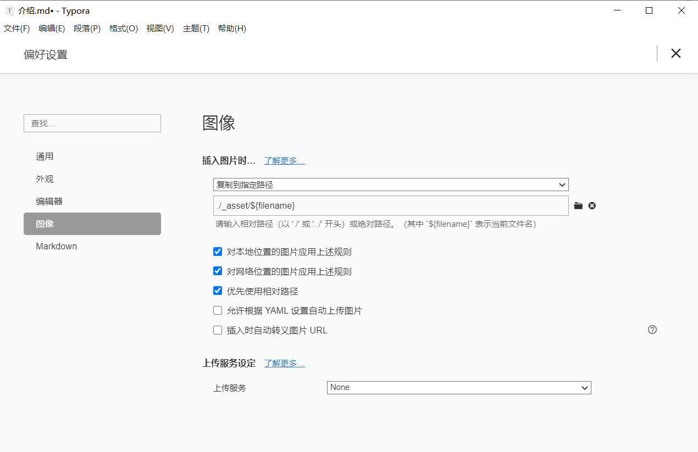

## 初衷

由于Onenote对于图片和公式支持实在是不好，所以一直有想换个笔记本记笔记的打算。

从@zthxxx的[帖子](https://www.v2ex.com/t/347176?p=2)找到灵感，准备使用Hexo+wiki主题做笔记本，然而貌似hexo的文件整理有点让人觉得难受，所以参照[这位大佬](https://noodlefighter.com/post/%E8%AE%A1%E7%AE%97%E6%9C%BA%E6%8A%80%E6%9C%AF-%E7%94%A8Hexo%E6%90%AD%E5%BB%BA%E4%B8%AA%E4%BA%BAWiki/)的思路，重新用python写了一个脚本（主要是我不会shell编程），加了一点点它里面没有的功能。

## 可以实现的功能

- 单独分出笔记本文件夹，可以使用Typora的大纲视图，更清晰
- 自动移动笔记到`source/_post/`文件夹下，并按照`hexo`的规则整理对应笔记中的图片
- 自动添加笔记的`yaml`头信息
- 自动更改笔记内图片的相对路径，使其能够在部署之后显示正常
- 不完全同步，仅同步七天内更新过的笔记
- 可自行添加其他功能

### 文件夹组织形式

```
.
├── wiki-source
|	  ├─ _config.yml
|	  ├─ package.json
|   ├── scaffolds
|   ├── source
|		...  ├- _post  #写的文章需要放在这个目录下
|			 ...
├── Notes   # 自己的笔记
|     ├── DL  #一级分类，自动指派为该分类下所有笔记的 categories  
|	  |     ├── _asset  # 该文件夹中保存本目录下的图像，按照笔记名进行分类
|     |		├── 1.md  #笔记
|	  |		├── FR #二级目录
|	  |			├── _asset # 该文件夹中保存本目录下的图像，按照笔记名进行分类
|	  |			...
|	  ....
script.py
```


###  注意

- 关于Tag：不会自动添加Tag，如果手动添加后，运行脚本会重新覆盖Tag，回到没有 Tag 的状态
- 关于笔记的`date`：脚本中会指派最近修改时间为笔记的`date`
- 关于笔记的`title` ：默认是笔记文件的文件名
- 如何判定文件是否被更新?
  - 仅考虑 Notes 下笔记的最新修改时间，若最近修改日期距离运行脚本的时间小于 7 天，脚本就会处理该笔记
  - 其实这块没想好怎么实现，因为不想粗暴的读取全部内容进行比较。而且本身 `Notes` 和 `_post` 中的文件也不一样，`_post` 中的文件有头信息。
- 图片：如果更新`Notes`的时候，删除了某些已经插入的图像，这些图像不会在`_post`中被删除（待更新）
- Typora的设置：

### 感谢

感谢 @zthxxx 耐心解答（即使回看我的问题确实很简单），凌晨五点还在回我的issue，大佬注意休息。; )

